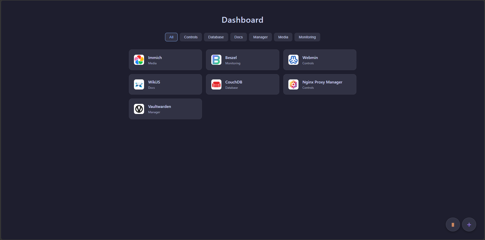

# Dashboard

Dashboard is a simple tool for organising links to all your tools. Quick, easy and stylish.

## Running (docker compose)

1. Clone the repository to your host - `git clone https://github.com/DerFacn/dashboard`
2. Enter the folder - `cd dashboard`
3. Edit configuration (DON'T FORGET TO EDIT THE ADMIN PASSWORD) - `nano docker-compose.yml`
4. Save and run the container - `docker compose up -d`

## Contributing

I'm absolutely free for contributing any cool features and stuff in this dashboard, but only if it's ok for open-source and not harmful for end-users.
